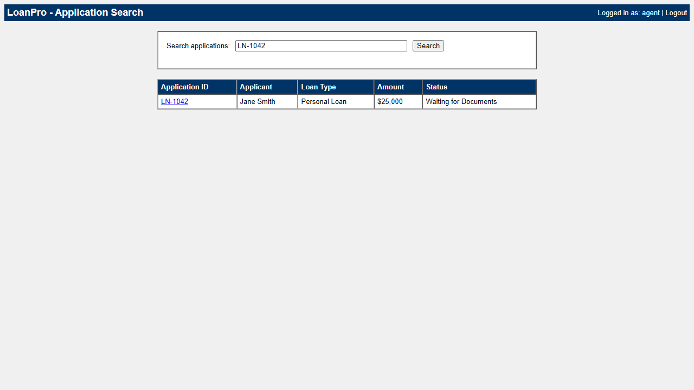
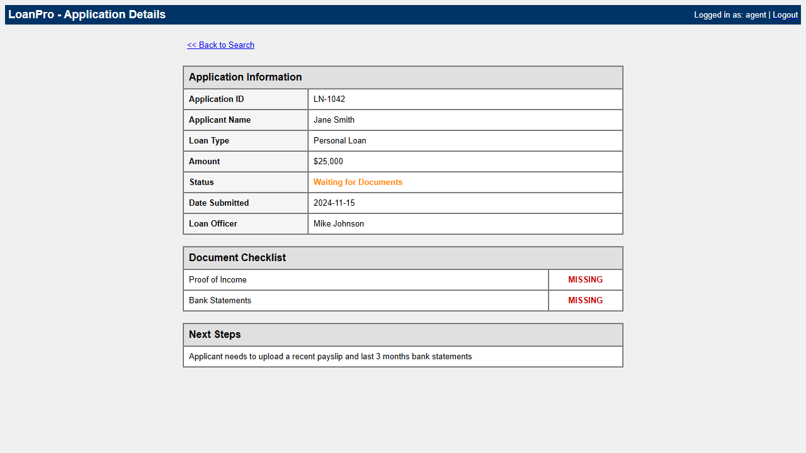
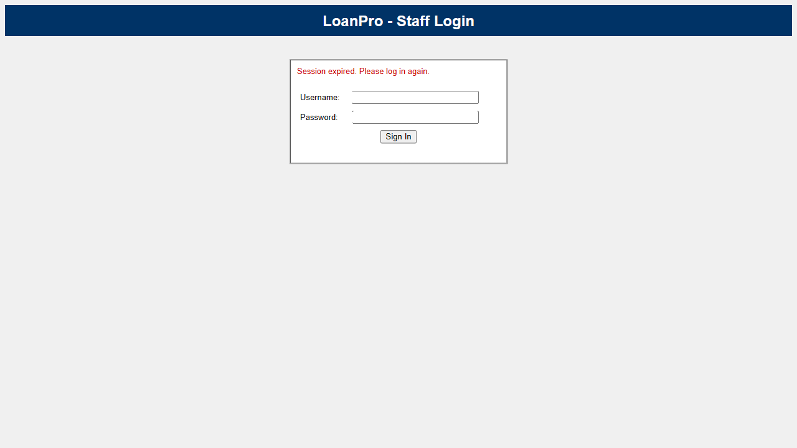

# Loan Status Agent

A computer-use automation system that lets an AI agent check loan application status in a legacy banking portal — discovering the workflow once with an LLM, then replaying it deterministically forever after.

I built this as a take-home project for interface.ai. The core design decisions, architecture, prompt engineering, and code logic are mine. I used Cursor as my implementation tool to move fast on scaffolding while I focused on the parts that matter — the artifact schema, replay robustness, error taxonomy, and handoff mechanism. Every piece of code was reviewed and validated by me before committing.

---

## Why does this exist?

Banks and credit unions run dozens of internal legacy apps with no APIs. The only way to automate them is to drive the UI the way a human would. This system does exactly that:

1. An LLM watches the screen, figures out how to accomplish a goal, and does it
2. The successful run is recorded as a reusable, parameterized "capability"
3. That capability replays deterministically — no LLM, no cost, no variability
4. When something goes wrong (session expires, unexpected state), a human takes over the same live session, fixes it, and hands control back

The result: AI agents get reliable, cheap, reviewable automation capabilities for apps that were never designed to be automated.

---

## Screenshots

### Discovery run — agent navigating the hostile portal


### Application detail page (the data being extracted)


### Escalation — human intervention prompt


---

## What does the portal look like?

The target app is a deliberately ugly "LoanPro" staff portal I built to simulate a real legacy banking back-office. It uses table-based layouts, `<font>` tags, `bgcolor` attributes, inline styles, and zero semantic HTML — no IDs on form inputs, no ARIA labels, no test attributes. This is what real legacy bank software looks like.

It has five synthetic loan applications with different statuses (Waiting for Documents, Under Review, Approved, Denied) and admin endpoints to inject faults like session expiry for testing.

---

## Setup

### Prerequisites

- Python 3.11 or higher
- A free API key from [OpenRouter](https://openrouter.ai) (takes 30 seconds to sign up)

### Installation

```bash
git clone https://github.com/DattaSaiPhanindra/Loan-Status-Agent.git
cd loan-status-agent
python -m venv .venv

# Activate the virtual environment
# macOS/Linux:
source .venv/bin/activate
# Windows:
.venv\Scripts\activate

pip install -e ".[dev]"
playwright install chromium
```

### Configuration

```bash
cp .env.example .env
```

Edit `.env` and set your OpenRouter API key:

**Getting your API key (takes 30 seconds):**
1. Go to [openrouter.ai](https://openrouter.ai) and sign up with Google or email
2. Click your profile icon → **Keys** → **Create Key**
3. Copy the key (starts with `sk-or-v1-...`) and paste it in `.env`

No billing setup needed — the model we use is on the free tier.

```
OPENROUTER_API_KEY=sk-or-v1-your-key-here
```

That's it. No database, no Docker, no external services.

---

## How to run the demo

You need two terminals — one for the portal, one for the agent.

### Terminal 1: Start the legacy portal

```bash
python cli.py serve-portal
```

Open http://127.0.0.1:8080 in your browser to verify it works. Log in with any username and password (it's a mock — any non-empty values work). You should see a deliberately ugly search page.

### Terminal 2: Run the three demo scenarios

#### Demo 1 — LLM Discovery

The agent uses an LLM to figure out how to check a loan application's status. It has never seen this portal before.

```bash
python cli.py discover "Check the status of loan application LN-1042 and report what is missing" http://127.0.0.1:8080/login --headless
```

**What to expect:** The agent will log in, search for LN-1042, click the result, read the detail page, and extract the status, missing documents, and next steps. Takes about 30-60 seconds depending on API response times. An artifact JSON file is saved to `artifacts/` and screenshots are saved to `evidence/`.

**Expected output:**

```
SUCCESS - Goal achieved in 7 steps
Extracted data:
{
  "status": "Waiting for Documents",
  "missing_documents": ["Proof of Income", "Bank Statements"],
  "next_steps": "Applicant needs to upload a recent payslip and last 3 months bank statements"
}
Artifact saved to: artifacts/<uuid>.json
```

#### Demo 2 — Deterministic Replay (no LLM)

Now replay the saved artifact on a different application — zero LLM calls, pure automation.

On macOS/Linux:
```bash
python cli.py replay artifacts/<artifact-file>.json '{"application_id": "LN-2099"}' --headless
```

On Windows PowerShell (which mangles JSON quotes), use this instead:
```powershell
python -c "
import asyncio, json, glob, uuid
from pathlib import Path
from playwright.async_api import async_playwright
from artifact.store import load_artifact
from replay.engine import run_replay

async def run():
    f = glob.glob('artifacts/*.json')[0]
    a = load_artifact(Path(f))
    async with async_playwright() as p:
        b = await p.chromium.launch(headless=True)
        pg = await b.new_page()
        r = await run_replay(pg, a, {'application_id': 'LN-2099'}, Path('evidence'), f'replay_{uuid.uuid4().hex[:8]}')
        print(f'Status: {r.status}')
        print(f'Outputs: {json.dumps(r.outputs, indent=2)}')
        await b.close()
asyncio.run(run())
"
```

**What to expect:** The replay logs in, searches, clicks, and extracts data in about 5 seconds. No LLM involved.

**Expected output:**

```
Status: success
Outputs: {
  "status": "Under Review",
  "missing_documents": [],
  "next_steps": "Pending credit committee review scheduled for next week"
}
```

Now try a non-existent application to see the three-way error taxonomy in action:

Use `LN-9999` as the application_id. You'll get:

```
Status: business_outcome
Outcome: not_found - Business outcome detected: no applications found
```

This is the critical distinction: "application not found" is a **legitimate business result**, not a crash. The caller handles it as data.

#### Demo 3 — Human Handoff (Escalation)

Force a session expiry during replay. The system pauses, asks a human to log in, then resumes.

```bash
python cli.py escalate-demo
```

**What to expect:** A browser window opens. The replay runs, but the session has been set to expire in 2 seconds. When it expires, you'll see this in the terminal:

```
============================================================
HUMAN INTERVENTION REQUIRED
Reason: session_expired
Message: Session expired during replay. Please log in again.
```

Go to the browser window, type `agent` for username and password, click Sign In. Come back to the terminal and press Enter. The replay retries and succeeds.

---

## How are the assessment requirements satisfied?

### Does the AI actually discover the workflow?

Yes. The discovery loop (`agent/loop.py`) runs an observe → decide → act cycle against the live portal. The `PlaywrightSurface` observes interactive elements via DOM queries, the `LLMClient` decides what to do using tool-calling, and the surface executes the action. The evidence folder contains screenshots from each step proving it happened.

### Is the artifact actually reusable and parameterized?

Yes. The artifact (`artifact/schema.py`) has typed `InputParameter` and `OutputField` definitions. The `application_id` is a parameter — you can replay with any ID without re-recording. The artifact is a JSON file you can read, review, and version-control.

### Does replay work without the LLM?

Yes. The replay engine (`replay/engine.py`) reads the artifact, resolves parameters, uses the locator strategy (primary selector + fallbacks) to find elements, and extracts outputs from page text. Zero API calls. Runs in 5 seconds.

### How does it handle errors?

Three-way result contract (`replay/result.py`):
- **success** — goal achieved, outputs extracted
- **business_outcome** — a legitimate result like "not found" or "access denied" (not a crash)
- **failure** — something broke, with `error_type`, `failed_step`, `expected` vs `observed`, and a screenshot

This is the distinction the brief calls "the most common design mistake."

### Can a human take over the live session?

Yes. The `SessionController` (`escalation/handoff.py`) pauses automation on the same browser page. The human operates the identical session — same cookies, same context. After they're done, automation resumes. The operator UI is a terminal prompt (a real console would use CDP or noVNC to stream the session), but the handoff mechanism is real.

### What about safety?

- **Allowlist** (`policy/guardrails.py`): only `127.0.0.1:8080` is permitted, `/admin/*` routes are blocked
- **Risk classification**: actions are classified as safe/read/write/irreversible based on element names
- **PII redaction**: SSNs, emails, phone numbers, account numbers are stripped before logging
- **Credentials**: login values are fixed in the artifact, never exposed as input parameters

---

## Project structure

```
portal/       Target legacy app (hostile HTML, session management, fault injection)
agent/        LLM discovery (Surface ABC, observe-decide-act loop, OpenRouter client)
artifact/     Capability schema (Pydantic), emitter, JSON file store
replay/       Deterministic executor, three-way result contract
policy/       Allowlist, risk classification, PII redaction
escalation/   Stuck detection, human handoff, session control transfer
evidence/     Run logs and screenshots from demo runs
artifacts/    Saved capability JSONs (git-tracked, reviewable)
scripts/      Utility scripts (artifact generation)
tests/        Schema, policy, and result contract tests
```

## Running tests

```bash
python -m pytest tests/test_core.py -v
```

23 tests covering schema round-trips, policy enforcement, risk classification, PII redaction, and the three-way result contract.

## Tech stack

- **Python 3.11+** — single language for everything
- **FastAPI + Jinja2** — the legacy portal (server-rendered, deliberately ugly)
- **Playwright** — browser automation (DOM queries, screenshots, headed/headless)
- **Pydantic v2** — typed schemas for artifacts, observations, actions, results
- **OpenRouter API** — LLM access via OpenAI-compatible endpoint. Uses `nvidia/nemotron-3-super-120b-a12b:free` (120B parameter model, free tier, no billing required)
- **Click** — CLI
- No database — artifacts are JSON files, evidence is screenshots and logs

## Logging

The system uses Python's standard `logging` module at multiple levels:

- **INFO**: Step-by-step progress during discovery and replay (`Replay step 3: Type application ID into search box`)
- **DEBUG**: Detailed locator resolution and checkpoint verification internals
- **WARNING**: Non-fatal issues like failed screenshots, non-critical step failures, and escalation triggers (`ESCALATION: session_expired — Session expired during replay`)

Set `LOG_LEVEL=DEBUG` in `.env` to see full detail.

## Evidence

The `evidence/` directory contains proof of real runs:

- `evidence/discovery_b95375a7/` — successful LLM discovery (7 steps, per-step screenshots, run_log.json)
- `evidence/replay_*/` — deterministic replay runs with outputs
- `evidence/escalation_4b8f61aa/` — escalation demo showing session expiry → human handoff → successful resume

---

*Built by Datta Sai Palaparthi. Core design and architecture decisions are mine. Cursor was used as an implementation accelerator — I wrote the prompts, reviewed every line, and validated all behavior manually.*
